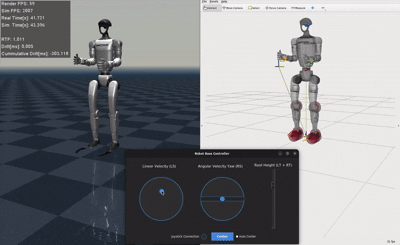

# Whole-Body Humanoid MPC

**Forked from [`manumerous/wb_humanoid_mpc`](https://github.com/manumerous/wb_humanoid_mpc) with some bugs fixed.**

This repository contains a **torque-controlled Whole-Body Nonlinear Model Predictive Controller (NMPC)** for humanoid loco-manipulation control. The MPC model and solvers are built up on [`leggedrobotics/ocs2`](https://github.com/leggedrobotics/ocs2), a powerful optimal control platform. The codes are successfully tested in [`ros2 humble`](https://docs.ros.org/en/humble/index.html).

### Interactive Velocity and Base Height Control via GUI & Joystick

<p align="center">
  
</p>

## MPC Formulations

This repository contains examples for two MPC formulations: **centroidal dynamics (hierarchical) vs. whole-body dynamics**.

### Centroidal Dynamics MPC
The centroidal MPC optimizes over the **whole-body kinematics** and the center of mass dynamics, with a choice to either use a single rigid body model or the full centroidal dynamics. This specific approach builds up on the centroidal model in ocs2 by generalizing costs and constraints to a 6-DoF contact among others. A conscise explanation of the ocs2 centroidal model can be found in [Sleiman et. al., A Unified MPC Framework for Whole-Body Dynamic Locomotion and Manipulation](https://arxiv.org/abs/2103.00946).

### Whole-Body Dynamics MPC
The **whole-body dynamics** MPC optimized over the contact forces and joint accelerations with the option to compute the joint torques for each step planned accross the horizon. The most relevant information on the choosen approach can currently be found in [Galliker et al., Bipedal Locomotion with Nonlinear Model Predictive Control: Online Gait Generation using Whole-Body Dynamics](http://ames.caltech.edu/galliker2022bipedal.pdf).

### Robot Example

The project supports [Unitree G1](https://www.unitree.com/g1) robot model.

## Get Started

### Setup Colcon Workspace

Create a colcon workspace and clone the repository into the src folder:

```bash
mkdir -p humanoid_mpc_ws/src && cd humanoid_mpc_ws/src
git clone https://github.com/wei-hsuan-cheng/wb_humanoid_mpc.git -b humble
```


### Build & run Dockerized workspace with bash scripts

This repository includes two helper scripts. Run them sequentially.

- [`image_build.bash`](./docker/image_build.bash) builds the `wb-humanoid-mpc:humble` Docker image with building arguments specified inside. 
   ```bash
   cd /path/to/humanoid_mpc_ws/src/wb_humanoid_mpc/docker
   ./image_build.bash
   ```

- [`launch_wb_mpc.bash`](./docker/launch_wb_mpc.bash) starts the Docker container, mounts your workspace, and drops you into a bash shell ready to build and run the WB Humanoid MPC code.
   ```bash
   cd /path/to/humanoid_mpc_ws/src/wb_humanoid_mpc/docker
   ./launch_wb_mpc.bash
   ```


### Building the MPC 

Building the WB MPC consumes a significant amount of RAM. We recommend saving all open work before starting the first build. The RAM usage can be adjusted by setting the `PARALLEL_JOBS` environment variable. Our recommendation is:

| PARALLEL_JOBS | Required System RAM |
|--------------:|--------------------:|
| 1 (default)   |  16 GiB             | 
| 4             |  32 GiB             |
| 6             |  64 GiB             | 


Build all required pkgs from a helper script [`Makefile`](./Makefile):
```bash
cd /path/to/humanoid_mpc_ws/src/wb_humanoid_mpc
make build-all PARALLEL_JOBS=1
```

If build each pkg seperately:

<details>
<summary>Build OCS2 core dependencies</summary>

```bash
# OCS2 dependencies
cd /path/to/humanoid_mpc_ws
colcon build --symlink-install --packages-select \
    ocs2_core ocs2_mpc ocs2_ddp ocs2_sqp \
    ocs2_robotic_tools ocs2_pinocchio_interface \
    ocs2_ros2_interfaces ocs2_ros2_msgs 
```

</details>

<details>
<summary>Build centroidal dynamics MPC</summary>

```bash
# For dummy sim
cd /path/to/humanoid_mpc_ws
colcon build --symlink-install --packages-select \
   ocs2_centroidal_model \
   humanoid_mpc_msgs humanoid_common_mpc humanoid_common_mpc_ros2 \
   humanoid_centroidal_mpc humanoid_centroidal_mpc_ros2 \
   remote_control g1_description g1_centroidal_mpc
```

</details>

<details>
<summary>Build whole-body dynamics MPC</summary>

```bash
# Dummy sim
cd /path/to/humanoid_mpc_ws
colcon build --symlink-install --packages-select \
  humanoid_mpc_msgs humanoid_common_mpc humanoid_common_mpc_ros2 \
  humanoid_wb_mpc humanoid_wb_mpc_ros2 \
  remote_control g1_description g1_wb_mpc
```

</details>

<details>
<summary>Build mujoco sim interfaces</summary>

```bash
# MuJoCo sim
cd /path/to/humanoid_mpc_ws
colcon build --symlink-install --packages-select \
  mujoco_sim_interface robot_core robot_model
```

</details>

## Running the examples
Once you run the NMPC a window with Rviz will appear for visualization. The first time you start the MPC for a certain robot model the auto differentiation code will be generated which might take up to **5-15 min** depending on your system. Once done the robot appears and you can control it via an xbox gamepad or the controls in the terminal. 

On the top level folder, run examples from [`Makefile`](./Makefile):

For the **Centroidal Dynamics MPC**

```bash
# Dummy sim
make g1-dummy-sim
# MuJoCo sim
make g1-mujoco-sim
```

For the **Whole-Body Dynamics MPC**

```bash
# Dummy sim
make g1-wb-dummy-sim
# MuJoCo sim
make g1-wb-mujoco-sim
```

Run `rviz2`
```bash
rviz2 -d <path_to_pkg>/wb_humanoid_mpc/humanoid_nmpc/humanoid_common_mpc_ros2/rviz/humanoid_zoom_in.rviz
```

#### Interactive Robot Control
Command a desired base velocity and root link height via **Robot Base Controller GUI** and **XBox Controller Joystick**. For the joystick it is easiest to directly connect via USB. Otherwise you need to install the required bluetooth Xbox controller drivers on your linux system. The GUI application automatically scanns for Joysticks and indicates whether one is connected. 


## Acknowledgements

This repository is originally forked from [`manumerous/wb_humanoid_mpc`](https://github.com/manumerous/wb_humanoid_mpc) and is built up on [`leggedrobotics/ocs2`](https://github.com/leggedrobotics/ocs2) with `ros2` migration.